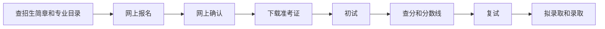

# 考研是什么

## 最简单的解释

“考研”就是报考硕士研究生。你通过报名、初试、复试、录取这些环节，争取进入高校或科研机构读硕士。

它不是“大学期末考试”，也不是“统一考试后随便选学校”。考研报名时就要确定目标招生单位、专业、方向、学习方式、考试方式和报考点。

## 考研选拔什么人

考研选拔的是硕士研究生，不是本科生，也不是博士生。中国学位层次大致是：

- 学士：本科阶段
- 硕士：研究生阶段
- 博士：更高层次研究生阶段

考上研只是获得入学资格。入学后还要完成课程、科研或实践训练、论文或实践成果答辩，符合要求后才可能获得硕士学历和硕士学位。

## 基本流程

## 常见分类

| 分类 | 新手解释 |
|---|---|
| 学硕 | 学术学位硕士，更偏理论、学术研究、科研训练。 |
| 专硕 | 专业学位硕士，更偏行业实践和职业能力。 |
| 全日制 | 通常脱产在校学习。 |
| 非全日制 | 通常在职或非脱产学习，很多学校原则上招在职定向人员。 |
| 非定向 | 毕业后自主双向选择就业。 |
| 定向 | 录取前和单位、学校签定向就业协议，毕业按协议就业。 |

## 新手不要误解

- 过初试不等于录取，还要复试。
- 过国家线不等于进目标院校复试。
- 学硕不天然高于专硕，二者培养目标不同。
- 非全日制不是“非正规”，但学习方式、学费、住宿、奖助和就业类别要逐项看招生章程。

## 来源

- [研招网：2026 年全国硕士研究生招生工作管理规定](https://yz.chsi.com.cn/kyzx/jybzc/202509/20250924/2293432108.html)
- [中国研究生招生信息网](https://yz.chsi.com.cn/)
- [全国人大：中国人民共和国学位法](https://www.npc.gov.cn/npc/c2/c30834/202404/t20240426_436840.html)

