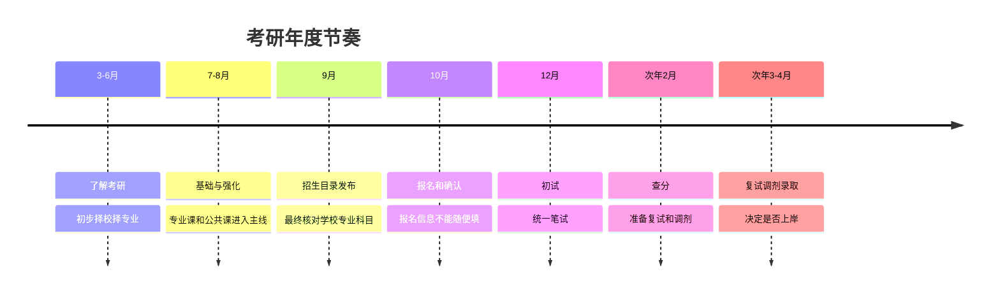

# 考研全年时间线

> [!warning] 不要机械套日期
> 2026 年研考的官方节点已经发布并执行；2027 年研考正式日程通常要等 2026 年下半年教育部和研招网公告。下面用 2026 年研考帮助你理解年度节奏。

## 最近一轮官方节点示例

| 环节 | 2026 年研考节点 | 新手要做什么 |
|---|---|---|
| 招生简章和专业目录 | 通常 9 月前后集中发布 | 确认学校、学院、专业、方向、考试科目、招生人数、限制条件。 |
| 预报名 | 2025-10-10 至 2025-10-13 | 预报名成功且缴费后通常有效，不是模拟填报。 |
| 正式报名 | 2025-10-16 至 2025-10-27 | 只能保留一条有效报名信息，逾期通常不能补报。 |
| 网上确认 | 各省和报考点公布 | 上传证件、照片、学历学籍材料等，没确认通常不能参加初试。 |
| 准考证下载 | 考前约 10 天 | 核对考点、考试时间、考试用品要求。 |
| 初试 | 2025-12-20 至 2025-12-21 | 全国统一笔试，特殊科目可能延至 12 月 22 日。 |
| 查分 | 次年 2 月前后 | 由招生单位、省考试院或研招网入口公布。 |
| 国家线 | 2026-02-28 公布 | 判断是否达到复试或调剂基本门槛。 |
| 复试 | 通常 3-4 月 | 学校组织专业、外语、综合面试等考核。 |
| 调剂 | 2026 年调剂系统 4 月 8 日开通 | 一志愿不稳时通过研招网调剂系统申请。 |
| 拟录取 | 通常 4 月前后 | 接受拟录取、公示、体检、政审、调档。 |
| 入学 | 通常 9 月 | 按录取学校通知报到。 |

## 年度节奏怎么理解

## 最容易错过的节点

- 网上确认：报名后还要确认。
- 准考证下载：考前不要忘记登录研招网。
- 复试材料提交：学校和学院通知可能很细。
- 调剂志愿锁定：正式调剂志愿有锁定时间。
- 待录取确认：收到后要在系统内确认。

## 来源

- [研招网：2026 年全国硕士研究生招生考试日程表](https://yz.chsi.com.cn/kyzx/kydt/202509/20250924/2293432116.html)
- [教育部部署 2026 年全国硕士研究生考试招生工作](https://hudong.moe.gov.cn/jyb_xwfb/gzdt_gzdt/s5987/202509/t20250924_1414763.html)
- [研招网：2026 年全国硕士研究生招生复试录取工作](https://yz.chsi.com.cn/kyzx/kydt/202602/20260228/2293449091.html)

