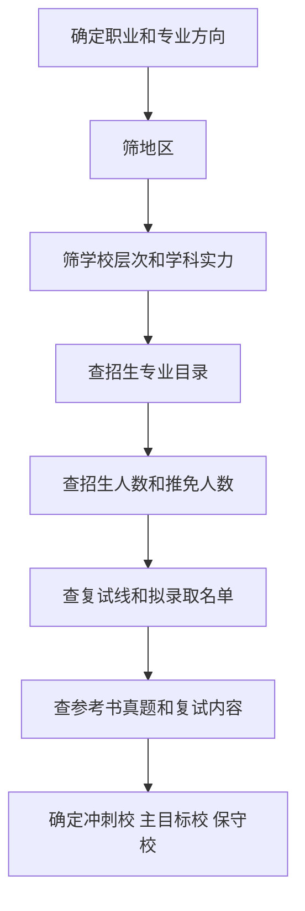

# 择校择专业方法

## 核心思路

择校择专业不要从“我想上名校”开始，而要从这些问题开始：

- 这个专业适合我吗？
- 考试科目我能学一年吗？
- 这个学校统考名额有多少？
- 近几年真实录取分数是多少？
- 考上后对就业或深造有没有意义？

## 推荐流程

## 信息源优先级

| 优先级 | 信息源 | 用途 |
|---|---|---|
| 1 | 研招网、教育部 | 政策、目录、报名、调剂、国家线。 |
| 2 | 目标院校研究生院官网 | 招生简章、专业目录、复试办法、拟录取名单。 |
| 3 | 目标学院官网 | 参考书、导师、复试细则、培养方案。 |
| 4 | 学校就业质量报告 | 就业地区、行业、单位性质。 |
| 5 | 学长学姐经验帖 | 只能补充，不能替代官方信息。 |

## 必查字段

| 字段 | 为什么重要 |
|---|---|
| 招生单位和院系 | 同一专业不同学院科目可能不同。 |
| 专业代码 | 区分学硕、专硕和相近专业。 |
| 研究方向 | 有些方向只接推免或名额很少。 |
| 学习方式 | 全日制和非全日制差别很大。 |
| 考试科目 | 决定备考内容。 |
| 拟招生人数 | 只是初筛，不等于统考名额。 |
| 推免人数 | 决定统考剩余空间。 |
| 复试线和拟录取名单 | 判断真实难度。 |
| 复试办法 | 判断复试权重和淘汰风险。 |

## 简单打分模型

| 指标 | 权重 |
|---|---:|
| 专业匹配度 | 20 |
| 考试科目匹配度 | 20 |
| 录取机会 | 25 |
| 学校和学科平台 | 15 |
| 地区与就业 | 15 |
| 信息透明度 | 5 |

80 分以上重点考虑；70-79 分作为备选；60-69 分谨慎；60 分以下不建议作为主目标。

## 一句话

考研择校不是排名游戏，而是信息验证游戏。先确认能不能报，再判断值不值得报，最后判断考上以后有没有意义。

## 来源

- [研招网硕士专业目录](https://yz.chsi.com.cn/zsml/)
- [研招网院校库](https://yz.chsi.com.cn/sch/)
- [教育部第二轮双一流建设高校及建设学科名单](https://www.moe.gov.cn/srcsite/A22/moe_843/202202/t20220211_598710.html)
- [全国第四轮学科评估结果](https://www.cdgdc.edu.cn/dslxkpgjggb/)

